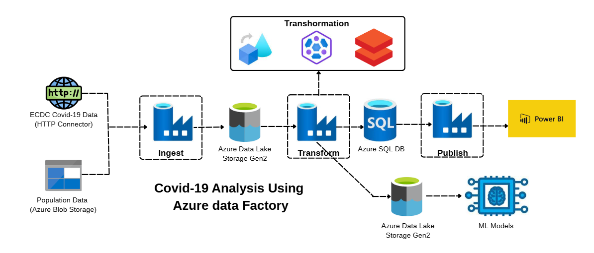
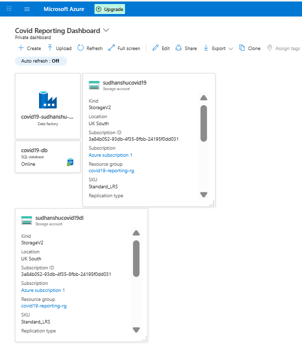

# Azure-Data-Factory---Covid19-Analysis

## **Introduction:**
This project focuses on building an end-to-end data engineering pipeline to analyze COVID-19 data across Europe. \
Azure Data Factory is used for automated data ingestion, while Azure Databricks, HDInsight and Data Flows handle scalable data transformation and processing. \
Azure Blob Storage and Azure Data Lake Gen2 provide reliable storage for raw and curated data. \
The processed data is published to Azure SQL Database and visualized through interactive Power BI reports to enable data-driven insights.

## **Project Architecture:**

## **Dataset:** 
We are using data from **European Centre for Disease Prevention and Control** through HTTP connector 
and **Population data** through Azure Blob storage.

## **Good Practices:**
### **Naming Conventions :**
>**Linked Service:** ls_(ablob/adls)_storagename\
>**Data Set:** ds_datatype_folder\
>**Pipeline:** pl_function

## **Creating Azure Resources:**
### **Create Azure data Factory:**
>Create Azure Data Factory : covid19-sudhanshu-adf  (give meaningful name)

### **Create Azure Blob Storage:**
>Create Azure Blob Storage: sudhanshucovid19 (give meaningful name, Small case) \
>search storage account > give subscription and resource group > create

### **Create Azure Data Lake Storage Gen2:**
>same as we created storage account.

> [!CAUTION]
>Just make sure to check Enable hierarchical namespace (under advanced)  this time.

### **Download storage Explorer:** 
>storage account > storage browser > download Azure Storage Explorer

**Login:**
>Azure portal > users > copy user principal name > and use this as login id to login

### **Create Azure SQL Database:**
>Azure SQL databse > create > Db name : covid19-db > server : create new > give unique name

>Use SQL authentication > give admin name and password

give these settings:

> [!NOTE]
> select Locally-redundant backup storage.

Networking:
give these settings:

### **Create a dashboard:**
>Azure Data Factory > Pin > Pin to dashboard > create new > Covid Reporting Dashboard

**pin all resources in the dashboard.**

