# Azure-Data-Factory---Covid19-Analysis

## **Introduction:**
This project focuses on building an end-to-end data engineering pipeline to analyze COVID-19 data across Europe. \
Azure Data Factory is used for automated data ingestion, while Azure Databricks and Data Flows handle scalable data transformation and processing. \
Azure Blob Storage and Azure Data Lake Gen2 provide reliable storage for raw and curated data. \
The processed data is published to Azure SQL Database and visualized through interactive Power BI reports to enable data-driven insights.

## **Project Architecture:**

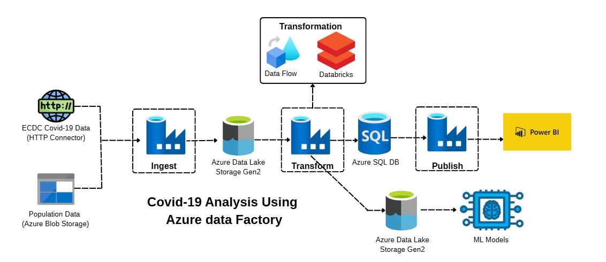

## **Dataset:** 
We are using data from **European Centre for Disease Prevention and Control** through HTTP connector 
and **Population data** through Azure Blob storage.\
We can get the ECDC data from the below link :

    https://www.ecdc.europa.eu/en/covid-19/data

## **Good Practices:**
### **Naming Conventions :**
>**Linked Service:** ls_(ablob/adls)_storagename\
>**Data Set:** ds_datatype_folder\
>**Pipeline:** pl_function

## **Creating Azure Resources:**
### **Create Azure data Factory:**
>Create Azure Data Factory : covid19-sudhanshu-adf  (give meaningful name)

### **Create Azure Blob Storage:**
>Create Azure Blob Storage: sudhanshucovid19 (give meaningful name, Small case) \
>search storage account > give subscription and resource group > create

### **Create Azure Databricks Workspace:**
>search Azure databricks > give subscription and resource group > create

### **Create Azure Data Lake Storage Gen2:**
>same as we created storage account.

> [!CAUTION]
>Just make sure to check Enable hierarchical namespace (under advanced)  this time.

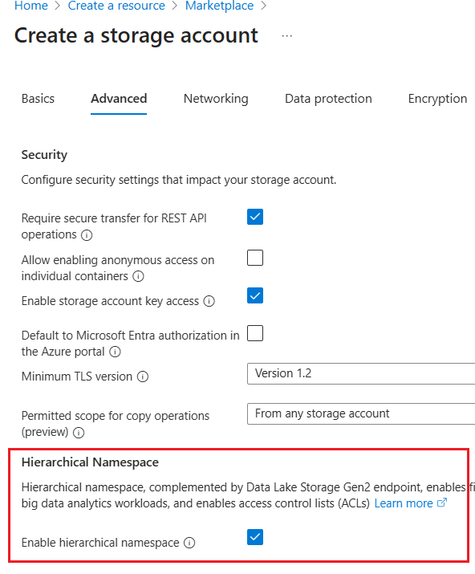

### **Download storage Explorer:** 
>storage account > storage browser > download Azure Storage Explorer

**Login:**
>Azure portal > users > copy user principal name > and use this as login id to login

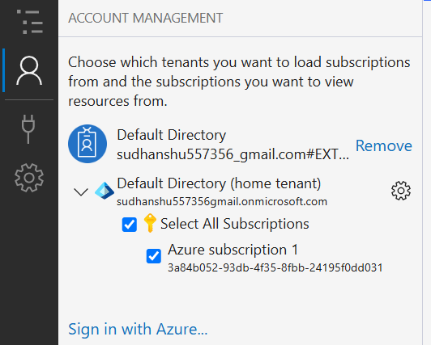

### **Create Azure SQL Database:**
>Azure SQL databse > create > Db name : covid19-db > server : create new > give unique name

>Use SQL authentication > give admin name and password

give these settings:

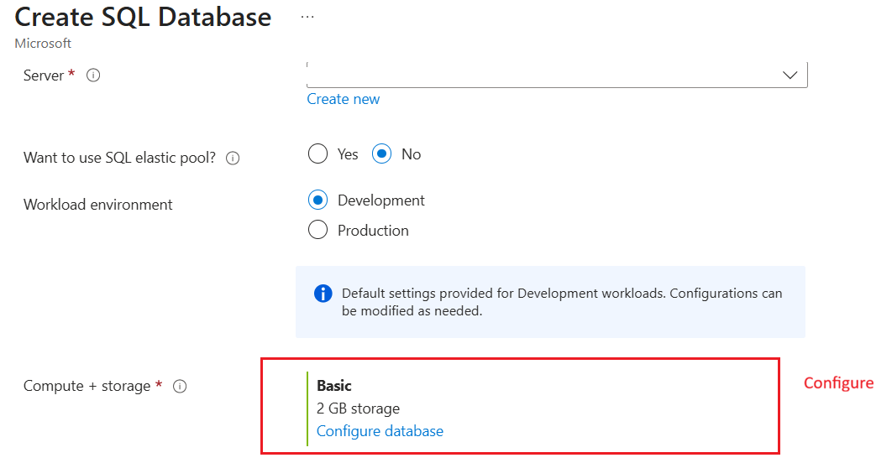

> [!NOTE]
> select Locally-redundant backup storage.

Networking:
give these settings:

### **Create a dashboard:**
>Azure Data Factory > Pin > Pin to dashboard > create new > Covid Reporting Dashboard

**pin all resources in the dashboard.**

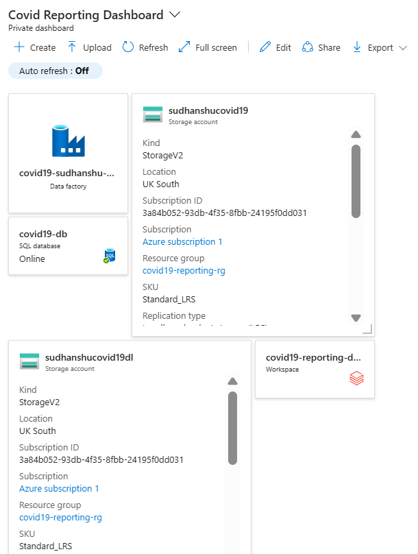

## **Creating Containors for Data Loading:**
- **Create Azure Blob Storage Containors:**\
  Create the containor : population\
  Storage account > storage browser > Blob container > Add > population \
  and upload the below file:\
  [population_by_age.tsv.gz](covid19_data_sets/population_data)
- **Create ADLS Gen2 Containors:**\
  Same as above create : raw

## **Data Ingestion:**
### **Create Pipeline to Ingest Population Data (pl_ingest_population_data):** 
- **Validation Activity:**\
  Check if the file : **population_by_age.tsv.gz** exists on the specific location\
- **Get Metadata Activity:**\
  Get column count for the input file.
- **If Condition Activity:**\
  Check the Count value from the metadata activity and match:

      @equals(activity('Get File Metadata').output.columnCount,13)
  If the match is:
  + **True:**
    * Copy Population Data_copy (Copy Acivity):
      - Copy the data to Sink (ADLS Gen2 Containor - raw)
    * Delete Activity:
      - On copy success delete the file from source.
   + **False:**
     * Fail Activity:
       - Raise error message (File Incompatible)\

Here is the complete pipeline:
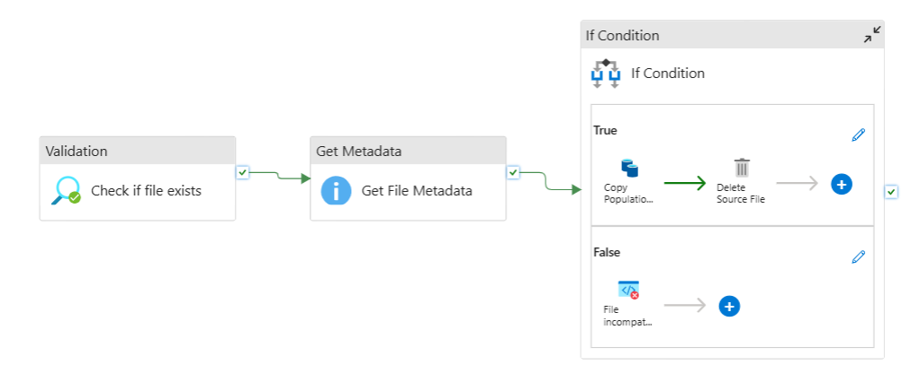

> [!WARNING]
> Publish the pipelines and Data sets ASAP, otherwise all changes will be lost.

- **Create Trigger (tr_se_pl_ingest_population_data):**\
  Create Event based trigger and attach the above pipeline in that.\
  Execute the trigger:
  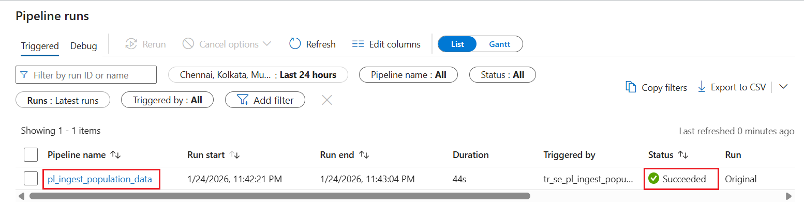

### **Create Pipeline to Ingest ECDC Data (pl_ingest_ecdc_data):** 
- **Lookup Activity:**\
  We have on lookup file having the below details:
  * Relative URL
  * Sink File Name\
So we can Ingest all the files from ECDC website.\
The lookup file is a JSON file : ecdc_file_list_for_2_files2.json\
Give this File as Input to Lookup Activity\
[ecdc_file_list_for_2_files2.json](Lookup_Files/ecdc_file_list_for_2_files2.json)

- **For Each Activity:**
  * Get the output value from the Lookup Activity using the below Item:

          @activity('Look for the ecdc details').output.value
  * Create Dataset for HTTP Source and create a parameter for **relative_url** and use this parameter in connection of this dataset:
    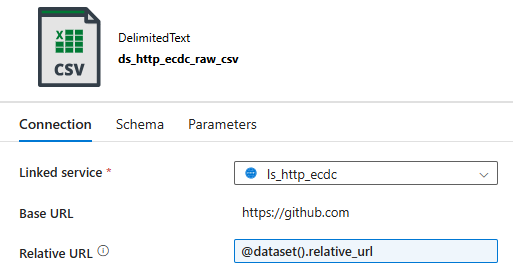
  * Create Dataset forSink ADLS Gen2 and create a parameter for **file_name** and use this parameter in connection of this dataset:
    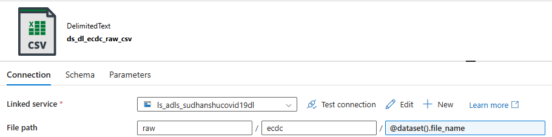
    
  * Create Copy Activity : **Copy ECDC Data** inside For Each, Using the output from Lookup Activity
    - Parameter value for Source:
      
      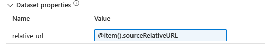
    - Parameter value for Sink:
      
      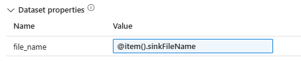

- **Complete Pipeline (pl_ingest_ecdc_data):**

  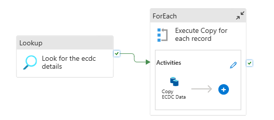
    

      
  
  
  

